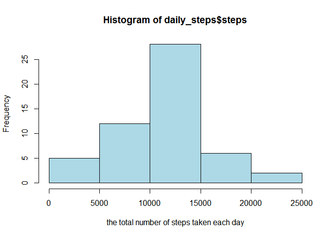
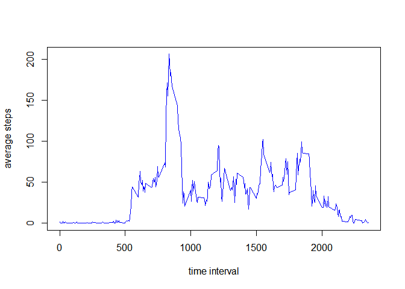
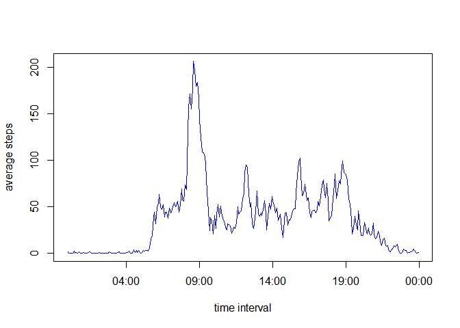
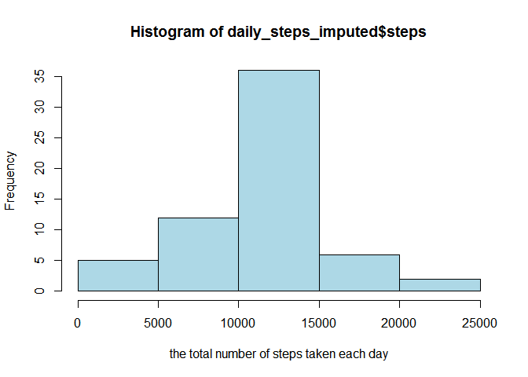
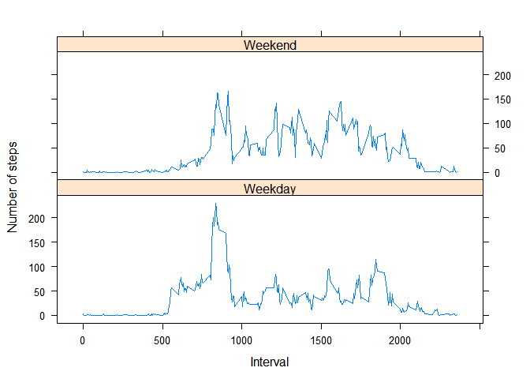

# Reproducible Research: Peer Assessment 1


## Loading and preprocessing the data
The data file [activity.zip](https://d396qusza40orc.cloudfront.net/repdata%2Fdata%2Factivity.zip) for this assignment is included in this folder. 


```r
unzip("activity.zip")
activity <- read.csv("activity.csv", header = TRUE)

head(activity)
```

```
##   steps       date interval
## 1    NA 2012-10-01        0
## 2    NA 2012-10-01        5
## 3    NA 2012-10-01       10
## 4    NA 2012-10-01       15
## 5    NA 2012-10-01       20
## 6    NA 2012-10-01       25
```

```r
sapply(activity, class)
```

```
##     steps      date  interval 
## "integer"  "factor" "integer"
```

```r
activity$date <- as.Date(activity$date, format = "%Y-%m-%d")
```
## What is mean total number of steps taken per day?

The histogram of the total number of steps taken each day:

```r
daily_steps <- aggregate(steps ~ date, data = activity, sum, na.action = na.omit)
hist(daily_steps$steps, col="lightblue",
     xlab = "the total number of steps taken each day")
```

 

Here are the mean and median total number of steps taken per day.

```r
mean(daily_steps$steps)
```

```
## [1] 10766
```

```r
median(daily_steps$steps)
```

```
## [1] 10765
```

## What is the average daily activity pattern?
For this part, to plot the data, one can simply do:

```r
mean_steps <- aggregate(steps ~ interval, data = activity, mean)
plot(steps ~ interval, data = mean_steps, type = "l", xlab = "time interval",
     ylab = "average steps", col="blue")
```

 

The above graph is acceptable, but not very natural near time intervals dividable by **100**. It is caused by the format of the time intervals. To have a more natural graph, one way is to transform the variable `interval` into datetime, store it in a new varible `time`, and then plot.  


```r
mean_steps <- aggregate(steps ~ interval, data = activity, mean)
mean_steps$time <- as.POSIXct(strptime(sprintf("%04d", mean_steps$interval), 
                                       format="%H%M"))
plot(steps ~ time, data = mean_steps, type = "l", xlab = "time interval",
     ylab = "average steps", col="blue")
```

 


```r
mean_steps[which.max(mean_steps$steps),]$interval
```

```
## [1] 835
```
So the 5-minute interval **835**, on average across all the days in the dataset, contains the maximum number of steps.

## Imputing missing values
Calculate and report the total number of missing values in the dataset (i.e. the total number of rows with `NA`s)

```r
sum(is.na(activity$steps))
```

```
## [1] 2304
```
So there are **2304** missing values in the dataset. In the following, a new dataset `activity_imputed` is created, which is equal to the original dataset `activity` but with each missing value replaced by the mean for that 5-minute interval. One can verify that there are no missing values in the new dataset `activity_imputed`.

```r
activity_imputed <- activity
for (i in 1:nrow(activity)){
    if (is.na(activity$steps[i])){
        index <- which(mean_steps$interval == activity[i,]$interval)
        activity_imputed$steps[i] <- mean_steps[index,]$steps
    }
}
sum(is.na(activity_imputed$steps))
```

```
## [1] 0
```

Here is a histogram of the total number of steps taken each day based on the new dataset.


```r
daily_steps_imputed <- aggregate(steps ~ date, activity_imputed, 
                                 sum, na.action = na.omit)
hist(daily_steps_imputed$steps, col="lightblue",
     xlab = "the total number of steps taken each day")
```

 

Here are the mean and median total number of steps taken per day based on the new dataset.

```r
mean(daily_steps_imputed$steps)
```

```
## [1] 10766
```

```r
median(daily_steps_imputed$steps)
```

```
## [1] 10766
```
Due to the method adopted in imputing the data, the mean is not changed; and the median is almost the same as those obtained from the original dataset. By comparing the histograms, one sees that the estimates of the total daily number of steps are increased.

## Are there differences in activity patterns between weekdays and weekends?

```r
activity_imputed$weekdays <- as.factor(ifelse(weekdays(activity_imputed$date) %in%
                                c("Saturday", "Sunday"), "Weekend", "Weekday"))

mean_steps_imputed <- aggregate(steps ~ interval + weekdays, 
                                data = activity_imputed, mean)
require(lattice)
```

```
## Loading required package: lattice
```

```r
xyplot(steps ~ interval | weekdays, data = mean_steps_imputed, type = "l", 
       xlab = "Interval", ylab = "Number of steps", layout = c(1 , 2))
```

 

One can use the same method as used in the above when finding the average daily activity pattern to obtain a more natural plot. But the plot above already shows the signaficant differences in activity patterns between weekdays and weekends.
